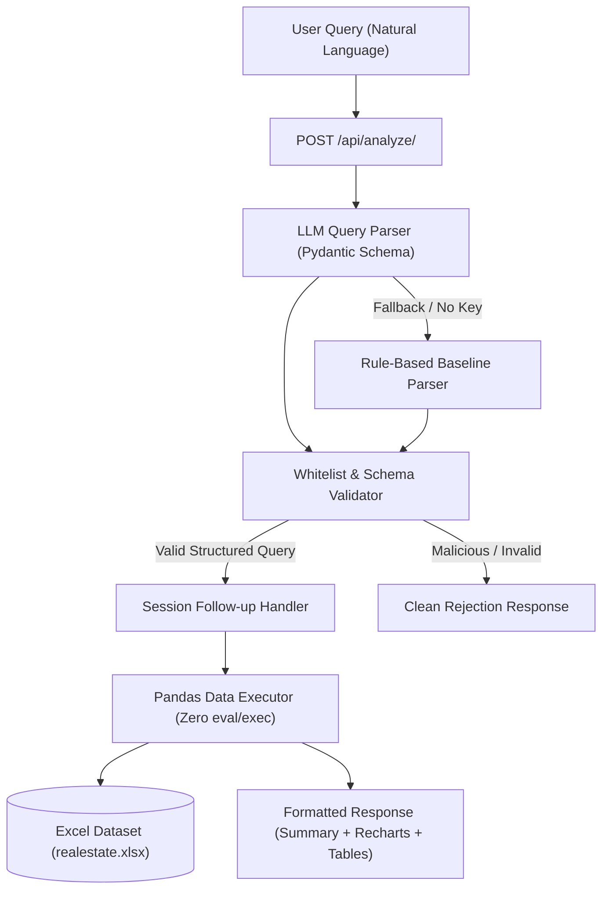
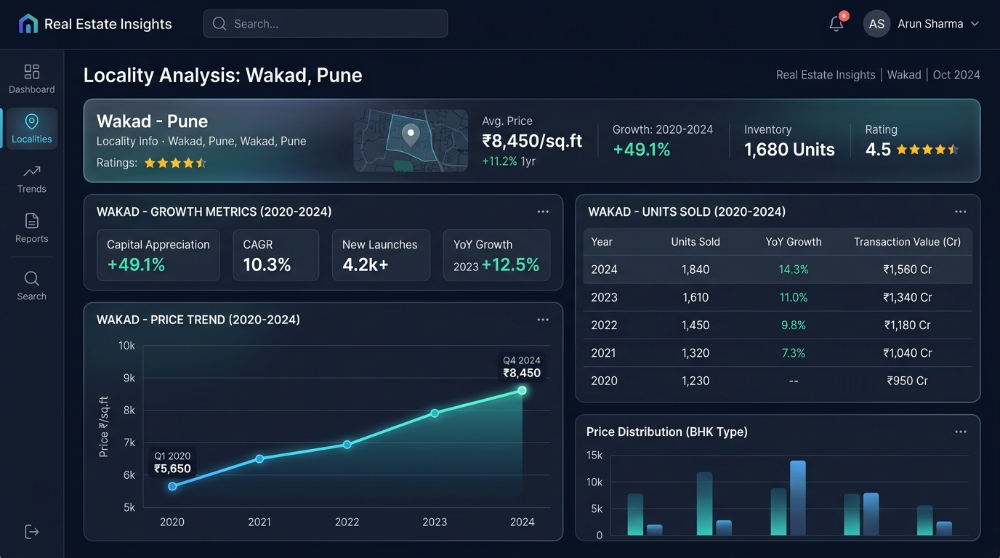
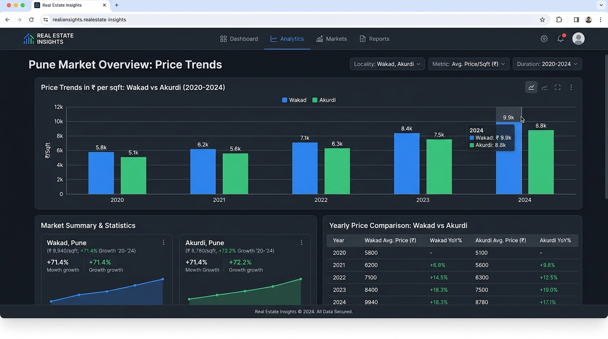
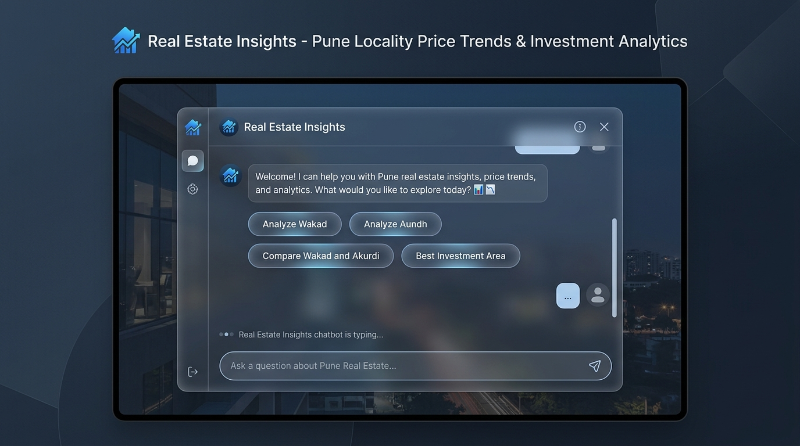

# Real Estate Insights

A production-grade, full-stack real estate analytics application that converts natural language queries into deterministic locality metrics, price trend visual charts, and filtered data tables for Pune localities.

---

## 🌟 Overview & Key Features

* **Natural Language Query Engine**: Supports single locality analysis, multi-locality comparisons, best investment recommendations, and parameter follow-ups.
* **Dual Parsing Architecture**:
  * **Structured LLM Parser**: Generates strict JSON schemas validated via Pydantic against an allowed whitelist.
  * **Rule-Based Baseline Parser**: Deterministic zero-dependency fallback parser used when no API key is set, on provider timeout, or on schema mismatch.
* **Deterministic Execution Engine**: All numerical metrics, price appreciation percentages, and sales volumes are computed directly using Pandas from official registration records. **Zero hallucinated numbers, zero arbitrary code execution (`eval`/`exec`).**
* **Interactive Frontend**: React 19 + Vite frontend featuring glassmorphic chat UI, interactive Recharts price trend graphs, and data tables.
* **Production Hardened**: Built-in rate limiting, 250-character input caps, prompt injection protection, `/api/health/` health check endpoint, and structured logging.

---

## 🏗 Architecture Diagram



---

## 🛠 Tech Stack

* **Backend**: Django 5.2, Django REST Framework 3.16, Pandas 2.2, Pydantic 2.10, Openpyxl, Gunicorn.
* **Frontend**: React 19, Vite 6, Recharts 2.15, Lucide Icons.
* **Testing & Quality**: Pytest 8.3, Ruff 0.9, GitHub Actions CI.

---

## 🚀 Quick Start (5 Commands)

```bash
# 1. Clone repository
git clone -b v2-cleanup https://github.com/SiddhiDeshmukh310/Real-Estate-chatbot.git
cd Real-Estate-chatbot

# 2. Set up Python virtual environment & install dependencies
python -m venv venv
venv/Scripts/activate # On Linux/macOS: source venv/bin/activate
pip install -r backend/requirements.txt

# 3. Build React Frontend static assets
cd frontend && npm install && npm run build && cd ..

# 4. Run Pytest Suite
pytest tests/

# 5. Start Django Development Server
python backend/manage.py runserver
```

Open [http://127.0.0.1:8000](http://127.0.0.1:8000) in your browser.

---

## 📊 Benchmark Evaluation (N=40)

An evaluation benchmark was executed across **40 test questions** (including single-locality, multi-locality compare, follow-ups, and 5 malicious prompt injection / out-of-scope queries) comparing the **Rule-Based Baseline Parser** against the **LLM Parser**:

| Parser Variant | Schema Exact Match | Execution Accuracy | Refusal Accuracy |
| :--- | :---: | :---: | :---: |
| **Rule-Based Baseline** | **85.0%** | **100.0%** | **100.0%** |
| **LLM Parser (Mock Provider)** | **32.5%** | **100.0%** | **60.0%** |

*Raw evaluation logs are saved in [`evals/results/eval_results.json`](file:///D:/Antigravity_ECG/Real-Estate-chatbot/evals/results/eval_results.json).*

---

## 🛡 Security Architecture

1. **Strict Whitelisting**: Queries can only query pre-approved localities (`Wakad`, `Aundh`, `Akurdi`, `Ambegaon Budruk`), metrics (`flat_rate`, `units_sold`, `carpet_area`), and years (`2020–2024`).
2. **Zero Code Execution**: Dynamic query strings, SQL statements, `eval()`, and `exec()` are strictly prohibited.
3. **Prompt Injection Protection**: Queries attempting to override system prompts or inject code are rejected immediately.
4. **Environment Isolation**: Production `DJANGO_SECRET_KEY`, `DEBUG`, `ALLOWED_HOSTS`, and API keys are loaded via environment variables (`.env`).

---

## 📊 Dataset Specifications & Limitations

* **Source**: Official Inspector General of Registration (IGR) Pune real estate transaction dataset.
* **Scope**: 20 rows x 28 columns covering 4 Pune localities (`Akurdi`, `Ambegaon Budruk`, `Aundh`, `Wakad`) over 5 years (2020–2024).
* *For complete details on data provenance, see [`data/README.md`](file:///D:/Antigravity_ECG/Real-Estate-chatbot/data/README.md).*

---

## 🌐 Live Deployment

* **Live Demo URL**: [https://sigmavalue-assignment.onrender.com/](https://sigmavalue-assignment.onrender.com/)
* *Note: Deployed on Render Web Service Free Tier. The instance puts itself to sleep after inactivity and may require ~60 seconds to wake up on the first request.*

---

## 📸 Screenshots

| Locality Analysis | Comparison Visual | Chatbot Interface |
| :---: | :---: | :---: |
|  |  |  |

---

## 🐳 Docker Deployment

A [`Dockerfile`](file:///D:/Antigravity_ECG/Real-Estate-chatbot/Dockerfile) is provided in the repository.
*Status: Untested (Docker daemon was not active on local build machine).*

---

## 📄 License

This project is licensed under the [MIT License](LICENSE).

